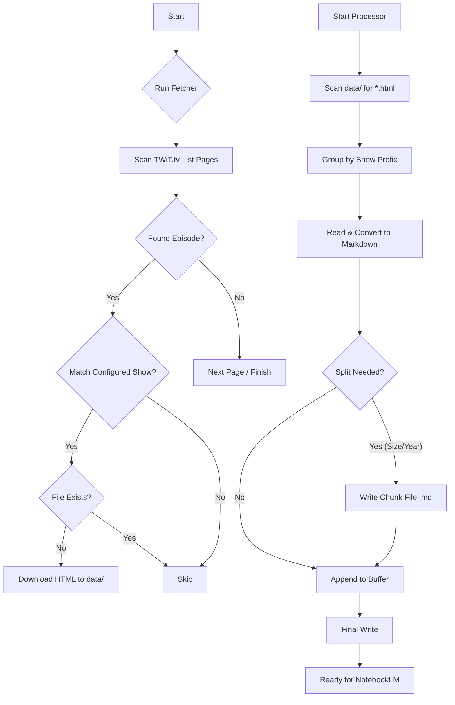

# Design Document: TWiT Transcript Archiver

## Overview

The goal of this project is to create a reliable pipeline for acquiring transcript data from the TWiT.tv network and preparing it for ingestion into Large Language Models (LLMs), specifically Google NotebookLM. The primary constraints are file size limits (500k words / 200MB) and the need for clean, structured text.

## Components

### 1. Fetcher (`fetch_transcripts.py` / `go/cmd/fetch-transcripts`)

**Architecture:**

* **Source:** Scrapes the paginated list at `https://twit.tv/posts/transcripts`.
* **Identification:** Uses a mapping of show titles (e.g., "This Week in Google") to internal prefixes (e.g., "TWIG").
* **Logic:**
  * Iterates through pages 1 to `N`.
  * Downloads list pages to `data/transcripts_page_{N}.html` (caching strategy: refresh recent pages, cache older ones).
  * Parses HTML to find transcript links.
  * Checks if the transcript title matches a requested show.
  * Checks if the target file `data/{PREFIX}_{EP_NUM}.html` already exists.
  * Downloads missing files.
  * **Retry Logic:** Implements exponential backoff for network failures.

**Design Decisions:**

* **Dependency-Free (Python):** Uses standard `urllib` and `re` to ensure portability without `pip install`.
* **Performance (Go):** Uses concurrent fetching (where appropriate) and efficient I/O.
* **Episode Number Parsing:** Critical for sorting. Extracted from the title/filename.

### 2. Processor (`process_transcripts.py` / `go/cmd/process-transcripts`)

**Architecture:**

* **Input:** Scans `data/` for files matching `{PREFIX}_*.html`.
* **Parsing:**
  * Extracts metadata: Title (`<h1>`), Date (`
`), Year (extracted from Date), and Body (`
`).
  * **HTML to Markdown:** Converts HTML tags (`
`, `<b>`, `<a>`) to Markdown equivalents to preserve structure without HTML overhead.
* **Chunking Strategy:**
  * Sorts episodes numerically.
  * Accumulates text into a buffer.
  * **Splitting Triggers:**
        1. **Word Count:** Exceeds 490,000 words (buffer for NotebookLM's 500k limit).
        2. **Byte Size:** Exceeds 190MB (buffer for 200MB limit).
        3. **Year Change (Optional):** If `--by-year` is enabled, splits when the calendar year changes.
  * **File Naming:**
    * Standard: `data/{PREFIX}_Transcripts_{START_EP}-{END_EP}.md`
    * Year-Based: `data/{PREFIX}_Transcripts_{YEAR}_{START_EP}_{END_EP}.md`

**Why Chunking?**

* LLM context windows and RAG (Retrieval-Augmented Generation) systems have per-file limits.
* Combining files reduces the number of "sources" (NotebookLM limit: 50), allowing years of content to be uploaded in fewer slots.

## Data Flow

## Limitations

* **Archive Depth:** The TWiT.tv transcript index seems to stop around 2014. Episodes prior to this are not accessible via this scraping method.
* **Formatting:** The conversion is heuristic-based. Complex tables or unusual HTML structures might be simplified.
