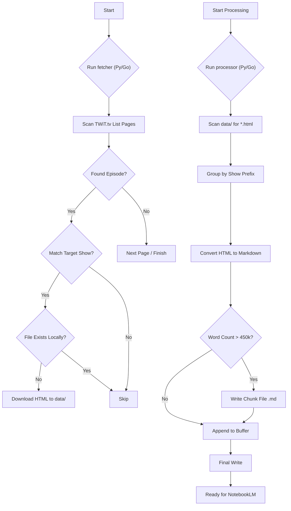

# TWiT Transcript Downloader & Processor

This toolset allows you to download transcripts from TWiT.tv and process them into clean, chunked Markdown files suitable for LLM context windows (specifically optimized for Google NotebookLM).

## Features

*   **Multi-Show Support:** Download transcripts for any major TWiT network show (Intelligent Machines, This Week in Google, Windows Weekly, Security Now, etc.).
*   **Smart Caching:** Caches list pages to avoid hammering the server, but refreshes recent pages to catch new episodes.
*   **Resume Capability:** Skips already downloaded transcript files.
*   **NotebookLM Ready:** Converts HTML to clean Markdown and chunks output files to stay under 500,000 words / 200MB limits.
*   **Robust Logging:** Includes a `--debug` flag to trace the scraper's logic.

## Usage

### 1. Fetch Transcripts

Use `fetch_transcripts.py` to download the raw HTML transcripts.

**Basic Usage (Download Intelligent Machines and This Week in Google):**
```bash
python3 fetch_transcripts.py
```

**Download Specific Shows:**
```bash
python3 fetch_transcripts.py --shows "Security Now" "Windows Weekly"
# OR use codes
python3 fetch_transcripts.py --shows SN WW
```

**Download All Supported Shows:**
```bash
python3 fetch_transcripts.py --all
```

**Options:**
*   `--pages N`: Number of index pages to scan (default: 200).
*   `--refresh-list`: Force re-download of index pages.
*   `--debug`: Show detailed logs of what is being skipped/downloaded.

### 2. Process Transcripts

Use `process_transcripts.py` to convert the downloaded HTML files into combined Markdown files.

**Process All Downloaded Transcripts:**
```bash
python3 process_transcripts.py --all
```

**Process Specific Shows:**
```bash
python3 process_transcripts.py --prefixes IM TWIG
```

The output files will be saved in the `data/` directory with names like `IM_Transcripts_805-847.md`.

## Directory Structure

*   `data/`: Stores all downloaded HTML files and generated Markdown files.
*   `fetch_transcripts.py`: The Python scraper script.
*   `process_transcripts.py`: The Python converter/chunker script.
*   `go/`: The Go implementation source tree.

## Logic Flow



### Text Diagram

```text
[ INTERNET ] 
      |
      v
(fetcher)
      |
      | 1. Scrapes List Pages (transcripts_page_N.html)
      | 2. Filters by Show (e.g., "IM", "TWIG")
      | 3. Downloads Episodes (IM_847.html)
      |
      v
[ ./data/ Directory ] <---- Stores raw HTML files
      |
      v
(processor)
      |
      | 1. Reads HTML files
      | 2. Cleans & Converts to Markdown
      | 3. Counts Words (Limit: 450,000)
      | 4. Batches episodes into chunks
      |
      v
[ Output Files ]
      |-- IM_Transcripts_805-818.md
      |-- ...
      |
      v
[ Google NotebookLM ]
```

## Python Implementation

### Requirements

*   Python 3.x
*   Standard libraries only (`urllib`, `re`, `argparse`, `glob`). No `pip install` required.

### Development & Testing

This project includes a comprehensive unit test suite using the standard `unittest` library.

**To run the tests:**

```bash
python3 -m unittest discover tests
```

Tests cover:
*   URL generation and page fetching (mocked).
*   HTML parsing and regex logic.
*   Markdown conversion and cleaning.
*   Robustness and error handling.

## Go Implementation

The project also includes a full Go implementation located in the `go/` directory.

### Requirements

*   Go 1.16+

### Usage

**Fetch Transcripts:**

```bash
cd go
go run cmd/fetch-transcripts/main.go --all
# OR specific shows
go run cmd/fetch-transcripts/main.go --shows SN WW
```

**Process Transcripts:**

```bash
cd go
go run cmd/process-transcripts/main.go --all
```

### Testing

The Go implementation includes a test suite covering scraping, conversion, and utility logic.

**To run the tests:**

```bash
cd go
go test ./...
```
